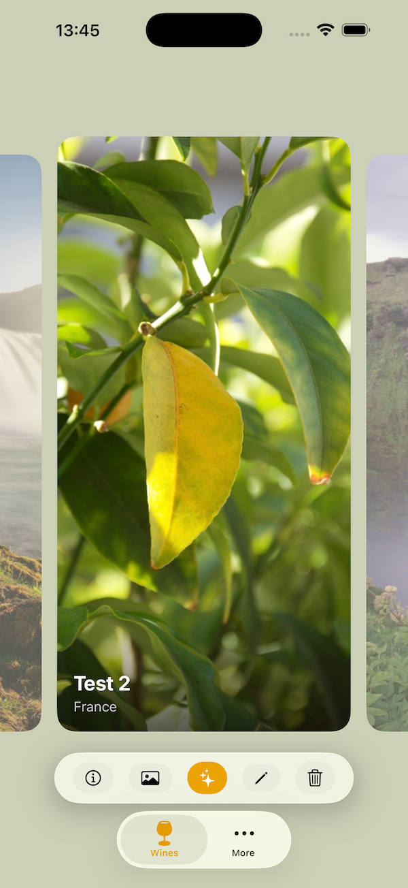
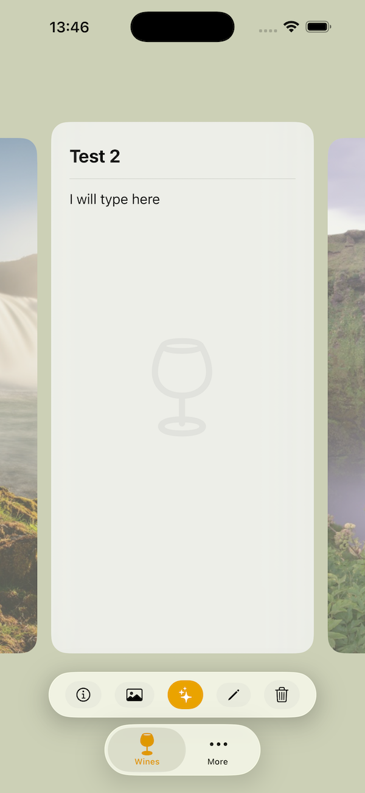
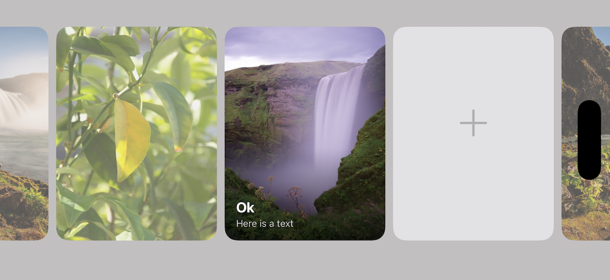

# CardCarouselKit

A domain-agnostic, endless-loop card carousel for SwiftUI. Horizontal paging with tap-to-flip animation, multi-photo navigation, and responsive layout across all iOS device configurations.

<p align="center">
  
  &nbsp;&nbsp;&nbsp;&nbsp;
  
</p>
<p align="center">
  
</p>

## Requirements

- iOS 26+
- Swift 6.2
- Xcode 26+

## Installation

Add CardCarouselKit via Swift Package Manager:

```swift
dependencies: [
    .package(url: "https://github.com/PavelGnatyuk/CardCarouselKit.git", from: "1.0.0")
]
```

Then import in your SwiftUI views:

```swift
import CardCarouselKit
```

## Quick Start

```swift
struct ContentView: View {
    let state = CardCarouselState()
    let items: [CardItem] = [...]

    var body: some View {
        CardCarouselView(state: state, items: items)
    }
}
```

### Supplying Cards

Create `CardItem` values with async image providers:

```swift
let card = CardItem(
    photos: [
        CardPhoto(
            cardSizeImageProvider: { await loadThumbnail() },
            originalImageProvider: { await loadFullImage() }
        )
    ],
    title: "Card Title",
    subtitle: "Subtitle",
    descriptionMarkdown: "**Bold** and *italic* text.",
    cardType: .regular   // .regular = tap flips, .special = tap triggers callback
)
```

### Custom Back Face

Replace the default markdown back view with your own:

```swift
CardCarouselView(state: state, items: items) { item in
    MyCustomBackView(item: item)
}
```

When the `backContent` closure is omitted, `CardBackView` (scrollable markdown) is used by default.

### Responding to Events

Conform to `CardCarouselDataSource` to receive carousel events:

```swift
class MyDataSource: CardCarouselDataSource {
    func carouselDidTapSpecialCard(_ card: CardItem) { ... }
    func carouselDidTapPhoto(card: CardItem, photoIndex: Int) { ... }
    func carouselWindowDidShift(visibleIndices: Range<Int>) { ... }
    func carouselDidRequestNextCard(after index: Int) async -> CardItem? { ... }
    func carouselDidRequestPreviousCard(before index: Int) async -> CardItem? { ... }
}
```

Pass it to the carousel:

```swift
CardCarouselView(state: state, dataSource: myDataSource, items: items)
```

### Overlay Positioning with CardFramePreferenceKey

The package reports the centered card's frame via a SwiftUI preference key, so the host app can position overlays (e.g., a nameplate) outside the package:

```swift
CardCarouselView(state: state, items: items)
    .overlayPreferenceValue(CardFramePreferenceKey.self) { frame in
        if frame != .zero {
            NameplateView(title: state.centeredCard?.title ?? "")
                .position(x: frame.midX, y: frame.maxY + 20)
        }
    }
```

## Public API

| Type | Role |
|------|------|
| `CardCarouselView` | Main carousel view, generic on `BackContent` for custom back face |
| `CardCarouselState` | `@Observable` shared state (current card index, flip state, etc.) |
| `CardCarouselDataSource` | Protocol for card supply and event handling |
| `CardItem` | Card data model: photos, title, subtitle, markdown description, card type |
| `CardPhoto` | Async image provider with card-size and original-size closures |
| `CardType` | `.regular` (tap flips) or `.special` (tap triggers callback) |
| `CardBackView` | Default back face (scrollable markdown), replaceable via `backContent` |
| `CardFramePreferenceKey` | Reports centered card frame for host-app overlay positioning |

## Layout

Card dimensions adapt automatically based on device and orientation:

| Context | Height | Width | Aspect Ratio |
|---------|--------|-------|-------------|
| iPhone portrait | 79% of container | 72% of container | ~3:4 |
| iPhone landscape | Available height minus toolbar | 30% of container max | 3:4 |
| iPad portrait | 65% of container | 320pt max | 3:4 |
| iPad landscape | 80% of container | 320pt max | 3:4 |

Neighboring cards peek in the margins. Swipe snaps one card at a time.

## Architecture

### Endless Loop

For 2+ items, the carousel builds a virtual slot array: `[last 3 items] + [all items] + [first 3 items]`. The buffer size is capped at the item count, so 2-item carousels use a buffer of 2. When the scroll enters a buffer zone, it repositions instantly to the matching real slot, creating a seamless infinite loop. Single-item carousels are non-looping.

### Image Caching

`AsyncCardImageView` uses a module-level `NSCache` keyed by photo UUID. The cache is checked during view initialization (not in `.task`), so recycled views display images on the first render frame with no placeholder flash.

### Flip Animation

Each card is a `ZStack` with front and back faces. Tap triggers a 3D Y-axis rotation with spring animation. Flip state is managed centrally in `CardCarouselState` and automatically reset for off-screen cards.

## License

MIT
